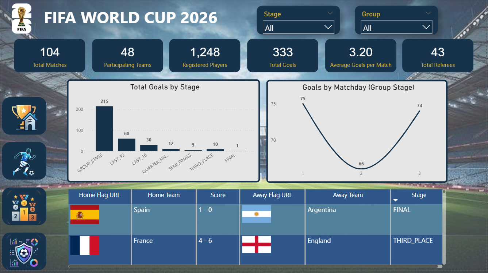
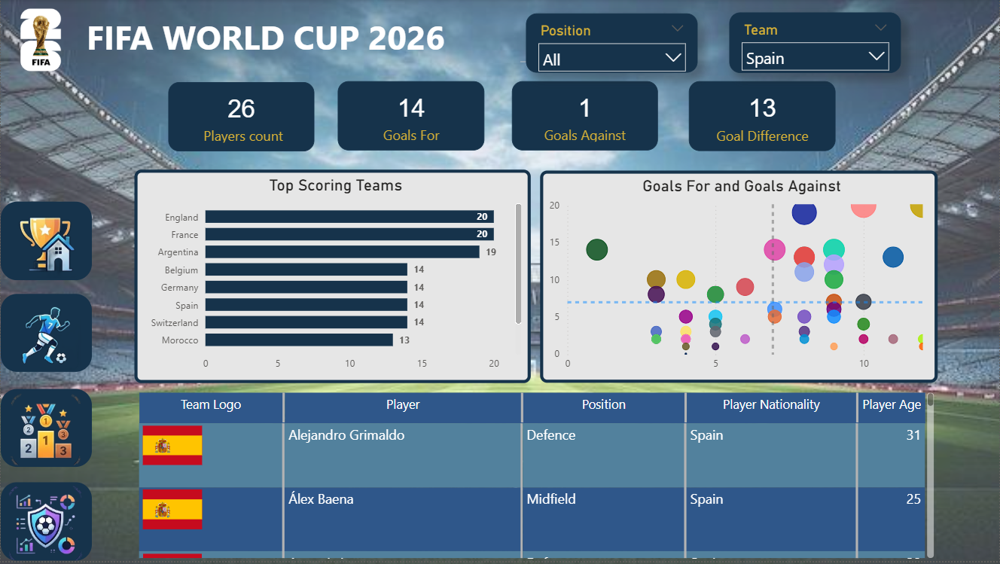
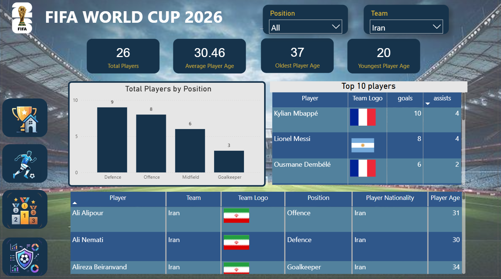
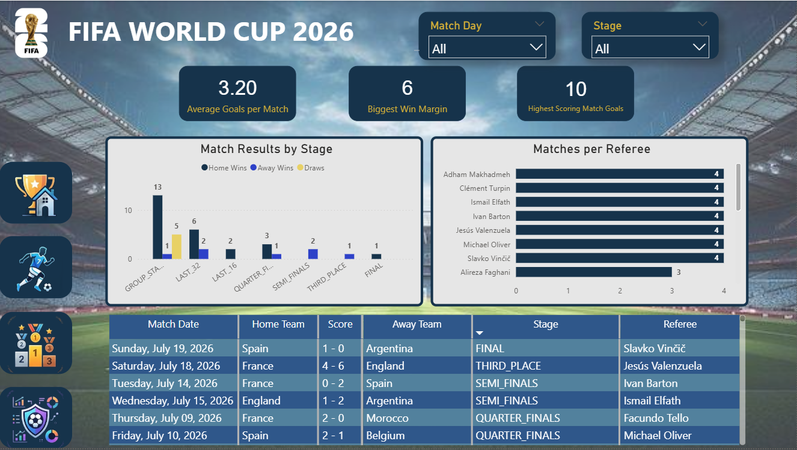

# ⚽ FIFA World Cup 2026 Dashboard

An interactive Power BI dashboard for exploring the FIFA World Cup 2026 through tournament statistics, teams, players, and match information.

## 🎯 Objectives

* Provide an interactive overview of the FIFA World Cup 2026
* Explore tournament statistics through interactive dashboards
* Analyze teams, players, and matches
* Allow users to filter and explore the data dynamically

## 📊 Dashboard Pages

| Page             | Description                                                                                                                     |
| ---------------- | ------------------------------------------------------------------------------------------------------------------------------- |
| **Overview**     | Key tournament KPIs, including total matches, total goals, registered players, participating teams, and average goals per match |
| **Teams**        | Explore participating teams and team-level statistics                                                                           |
| **Players**      | Explore player information and player-level statistics                                                                          |
| **Match Center** | Explore matches, match details, and tournament information                                                                      |
| **Homepage**     | Main navigation page for accessing different sections of the dashboard                                                          |

## 🖼️ Dashboard Preview

### Overview



### Teams



### Players



### Match Center



## 🛠️ Tools & Techniques

* **Power BI Desktop** — dashboard development and data visualization
* **Power Query** — data cleaning and transformation
* **DAX** — measures and calculations
* **Data Modeling** — building relationships between fact and dimension tables
* **Interactive Filters & Slicers** — dynamic data exploration

## 🗂️ Data

The dashboard uses FIFA World Cup 2026 tournament data for educational and portfolio purposes.

The data was transformed and modeled in Power BI before being used to build the dashboard.

## 📌 Key Metrics

The dashboard includes metrics such as:

* **Total Matches**
* **Total Goals**
* **Registered Players**
* **Participating Teams**
* **Average Goals per Match**

## 🚀 How to Open

1. Clone or download this repository.
2. Open `fifa dashbord_rafighi.pbix` with **Power BI Desktop**.
3. If Power BI requests a data refresh, follow the prompts to refresh the dataset.
4. Use the dashboard navigation and filters to explore the tournament data.

## 📁 Repository Structure

```text
fifa-2026-dashboard/
│
├── Screenshots/
│   ├── homepage.PNG
│   ├── matchcenter.PNG
│   ├── overview.PNG
│   ├── player.PNG
│   └── teams.PNG
│
└── fifa dashbord_rafighi.pbix
```

---

### 👩‍💻 Author

**Mohadese Rafighi**

Data Science | Data Analysis | Power BI
